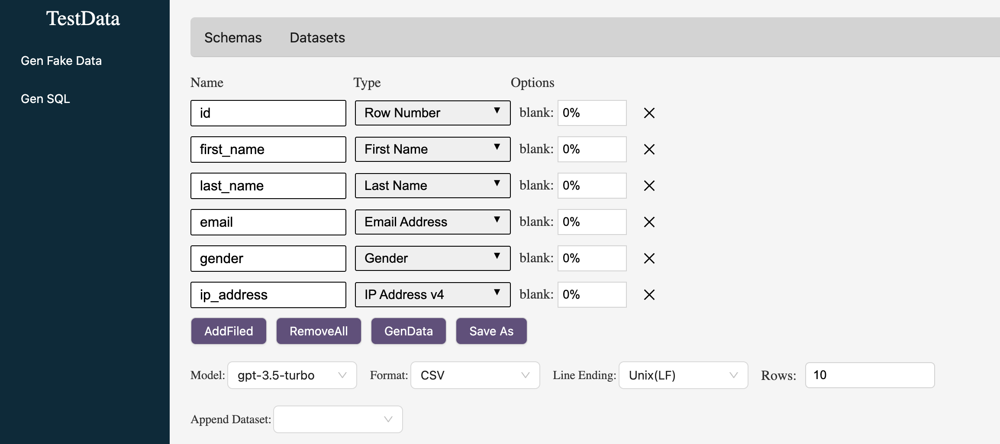

### `Configure LLM`
Set OPENAI_API_KEY env variable

Set OPENAI_API_BASE env variable

### `Prepare database`
Install mongodb,create database "speedtestdata"

Install postgresql,create database "speedtestdata"

set your own user and password of database in src/backend/config/configs.js

init table with src/backend/database/init.sql in postgressql

### `Run the APP`
npm start 

Open [http://localhost:5173](http://localhost:5173) to view it in your browser.

npm run backend

Runs backend server, the server url is http://localhost:5000

### `Note`
langchain js has not support other model, so our app only can use gpt-xx-xx model

### `How to use it?`
For GenSQL, you can import xxx.sql schema file in src/testata

For GenData, upload dataset csv file must include field name 

### `Erros solution`
5000 port has been used issue can be fixed if user disable AirPlay Receiver. It is only an issue for M1

### `App showcase`
App showcase see [here](https://www.bilibili.com/video/BV1hm421G7Kw/?vd_source=3ded1b3c4a48f2c92f768cd60a0bb913)

### `Home page`

